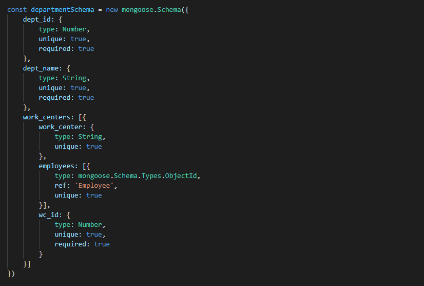

# Documentation

## Database

### Collections

| Collection    | Reference(s)  |
| ------------- | ------------- |
| departments   | employees     |
| employees     | none          |
| inventories   | maybe vendors |
| opportunities | undecided     |
| catalogs      | products      |
| products      | none          |
| projects      | inventory, maybe catalog |
| vendors       | none          |

## Schemas

### catalog:

```
const catalogSchema = new mongoose.Schema({})
```

### department:



### employee:


### inventory:


### opportunity

```
const opportunitySchema = new mongoose.Schema({})
```

### product

```
const productSchema = new mongoose.Schema({})
```

### vendor

```
const vendorSchema = new mongoose.Schema({})
```

## Routings

| Type          | Route         | Description   |
| ------------- | ------------- | ------------- |
| GET           | /             | ?             |
| GET           | /             | ?             |
| GET           | /             | ?             |