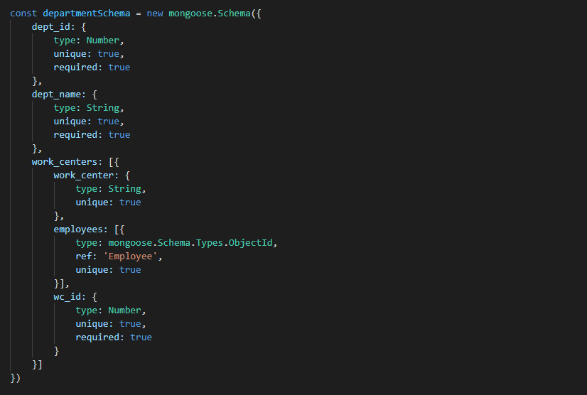
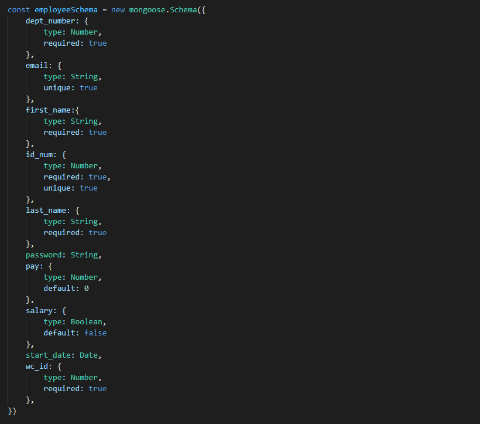
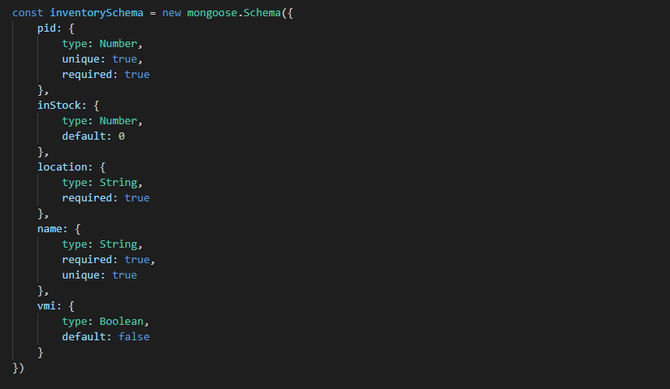

# Documentation

## Routings

| Type    | Route                | Description   |
| ------- | -------------------- | ------------- |
| GET     | /                    | Welcome Message |
| GET     | /products            | Fetches All Products |
| GET     | /products/:id        | Finds a Product that matches :id |
| GET     | /products/find/:name | Finds a Product that matches :name |
| GET     | /products/time/:id   | Calculates Estimated Time to Build Product |
| GET     | /products/price/:id  | Calculates Estimated Price to Build Product |
| GET     | /products/parts/:id  | Returns a list of all required parts needed to build Product |
| POST    | /products            | Creates a new Product |
| PUT     | /products/:id        | Updates given fields in Product |
| DELETE  | /products/:id        | Finds a Product that matches :id & Deletes it |

## Database

### Collections

| Collection    | Reference(s)  |
| ------------- | ------------- |
| departments   | employees     |
| employees     | none          |
| inventories   | maybe vendors |
| opportunities | undecided     |
| catalogs      | products      |
| products      | none          |
| projects      | inventory, maybe catalog |
| vendors       | none          |

## Schemas

### catalog:

```
const catalogSchema = new mongoose.Schema({})
```

### department:



### employee:



### inventory:



### opportunity

```
const opportunitySchema = new mongoose.Schema({})
```

### product

```
const productSchema = new mongoose.Schema({})
```

### vendor

```
const vendorSchema = new mongoose.Schema({})
```